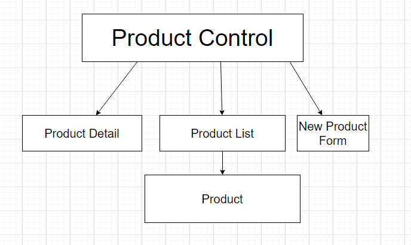

# _Merch-Site_
An application for learning React CRUD functionality.

### _**Geof Rosenmund, Andy Lawson, Kerry Lang**_

[Epicodus](https://www.epicodus.com/) - [React](https://www.learnhowtoprogram.com/react) - [React Fundamentals](https://www.learnhowtoprogram.com/react/react-fundamentals)

#### Date created: 04/21/2021 - 04/22/2021
---

## Technologies Used

* _JavaScript_
* _JSX_
* _React_
* _SASS_
* _draw.io_
* _git 2.30.0_

---

## Description

A React web app for creating, deleting, and updating items such as products or merchandise.

## Component Diagram
Diagram showing parent and children components and how they will be structured in relation to one another:

---

## Setup/Installation

* To clone this directory, navigate in your terminal to the desired location of the project and run command `git clone https://github.com/andyL89/merch-site.git`
* Navigate to top level of the directory with command `cd merch-site`
* Run local server with command `npm run start`

---

## Editing Instructions

* To use Visual Studio Code to edit this project, follow install instructions [here](https://code.visualstudio.com/).
* To enable command `code`, open VS Code, click on View > Command Palette, type in "shell command", and click on "Shell Command: Install 'code' command in PATH"
* Now, from your terminal, in the project's top level directory, you can run command `code .` to open project in VS Code.

---

## Known Bugs

---

## License

[MIT](LICENSE.txt)

---

## Contact Information

* _Contact Geof via [Email](mailto:geof.rosenmunds.email@gmail.com) or [LinkedIn](https://www.linkedin.com/in/geofrosenmund/), or check out his [Github](https://github.com/CrankyJones)._

* _Contact Andy via [Email](mailto:alawson89@gmail.com) or [LinkedIn](https://www.linkedin.com/in/andrew-lawson-dev/), or check out his [Github](https://github.com/andyL89)._

* _Contact Kerry via [Email](mailto:klang812@gmail.com) or [LinkedIn](https://www.linkedin.com/in/kerrylang1/), or check out his [Github](https://github.com/klang812)._